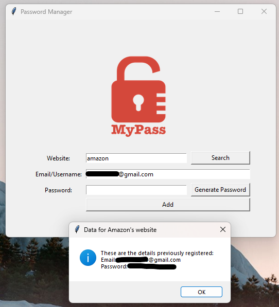
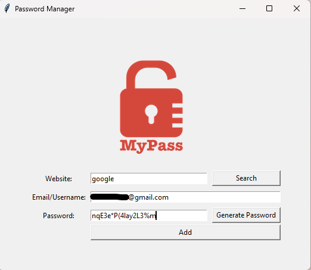

# Gestionnaire de mots de passe

## Présentation

Ce gestionnaire de mots de passe est une application développée en Python avec une interface utilisateur créée à l'aide du module Tkinter. Il permet à l'utilisateur de générer des mots de passe aléatoires, de rechercher des mots de passe précédemment enregistrés pour un site Web spécifique et d'enregistrer de nouveaux mots de passe associés à des sites Web.

## Fonctionnalités

- **Générateur de mots de passe (`generate_password()`):** La fonction de génération de mots de passe crée des mots de passe aléatoires avec une combinaison de lettres, de chiffres et de symboles. Les mots de passe générés sont automatiquement copiés dans le presse-papiers pour une utilisation facile. (`pyperclip.copy(password)`)
- **Recherche de mot de passe (`search_password()`):** Les utilisateurs peuvent rechercher des mots de passe précédemment enregistrés associés à un site Web spécifique.
- **Enregistrement de mot de passe (`save_password()`):** L'application permet aux utilisateurs d'enregistrer de nouveaux mots de passe avec les informations correspondantes sur le site Web.

## Utilisation

1. **Génération de mot de passe:** Appuyez sur le bouton "Générer un mot de passe" pour créer un nouveau mot de passe aléatoire. Le mot de passe généré sera automatiquement copié dans le presse-papiers.
2. **Recherche de mot de passe :** Entrez le nom du site Web dans le champ "Site Web" et appuyez sur le bouton "Rechercher" pour afficher les informations de connexion enregistrées.
3. **Enregistrement de mot de passe :** Remplissez les champs "Site Web", "E-mail/Nom d'utilisateur" et "Mot de passe" avec les informations appropriées, puis appuyez sur le bouton "Ajouter" pour enregistrer le mot de passe.

## Installation et configuration

- Python 3.9.6
- Modules inclus dans l'installation standard de Python: tkinter, json, pyperclip, random

## Interface utilisateur

## Remarques
- Ce projet a été réalisé dans le cadre du cours [100 Days of Code: The Complete Python Pro Bootcamp](https://www.udemy.com/course/100-days-of-code/) de Angela Yu sur la plateforme Udemy.
